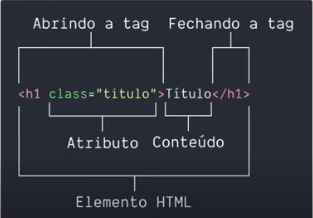

# 	Curso de HTML


## 	Elemento HTML



​	O elemento html é a base e significa que tudo que esta dentro de um arquivo.html é um elemento html

````html
<!DOCTYPE html> <!-- Não é um elemento html, apenas diz ao navegador o que esta escrecendo -->
<html> <!-- Tudo que estiver dentro da tag será elemento html -->
    <head> <!-- Meta informações que o motor de busca e o navegador necessitam -->
        <meta> <!-- Como exemplo o charset para como o navegador vai fazer o incode dos caracteres -->
        <title></title> <!-- Coloca o titulo na aba do navegador -->
    </head> <!-- Fecha a tag -->
    <body> <!-- Onde fica o conteúdo -->
        
    </body> <!--Fechamento da tag -->
</html> <!-- Fecha a tag -->
````